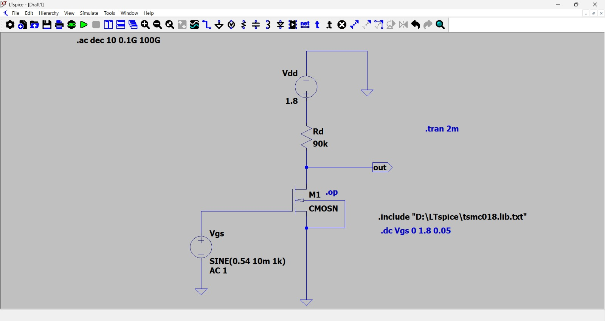
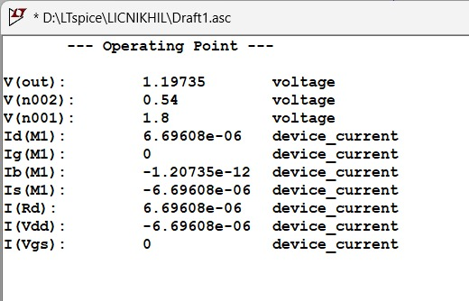
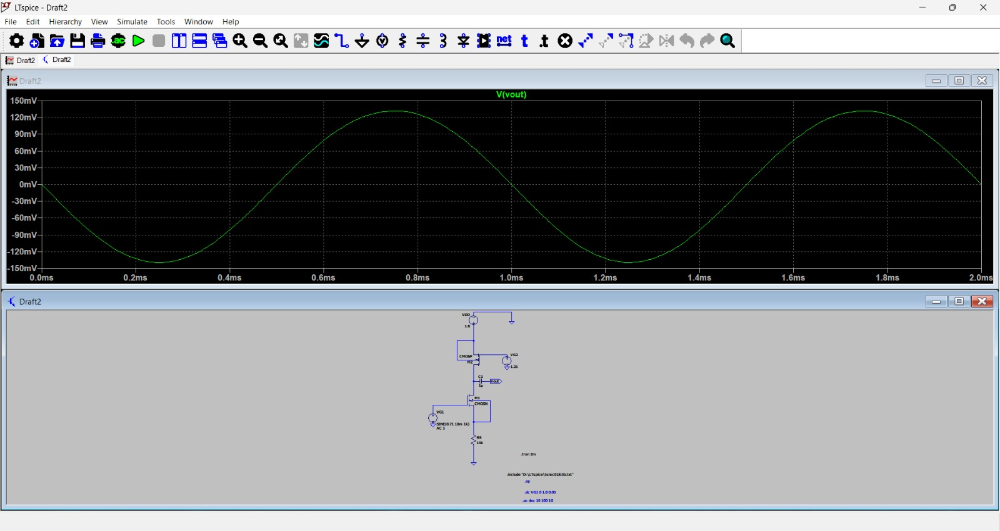
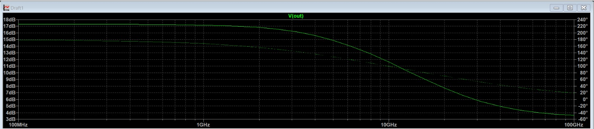
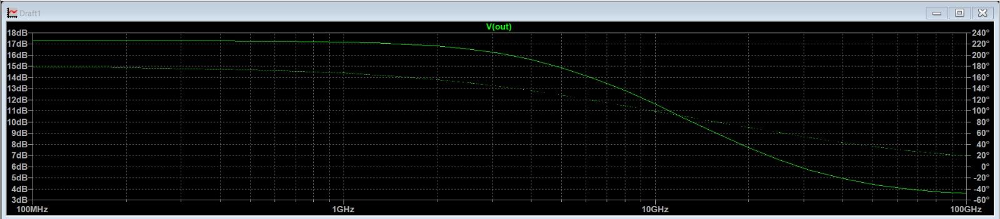

# Experiment 01  
# Common Source (CS) Amplifier Analysis

---

## 1. Objective

To design and analyze a Common Source (CS) amplifier using MOSFET and evaluate its performance using LTSpice.

The performance is evaluated based on:

- DC operating point
- Voltage gain
- Frequency response
- Output swing
- Effect of load capacitance

---

## 2. Technology & Simulation Environment

- Simulation Tool: LTSpice
- Supply Voltage (VDD): 1.8 V
- Load Capacitance (CL): 1 pF

Analyses Performed:
- DC Analysis (.op)
- Transient Analysis (.tran)
- AC Analysis (.ac)

---

## 3. Circuit Description

The Common Source amplifier consists of:

- NMOS transistor as input device
- Load resistor / active load
- Input signal applied at gate
- Output taken at drain

---

## 4. Schematic

---

## 5. DC Operating Point Analysis

Purpose:
- Verify transistor operates in saturation
- Measure VGS, VDS, ID

---

## 6. Transient Analysis

Purpose:
- Verify amplification
- Measure output waveform
- Check distortion

---

## 7. AC Small-Signal Analysis

### Without Load

### With Load (CL = 1pF)

---

## 8. Theoretical Analysis

- Gain (Av) ≈ -gm × RD
- gm = 2ID / Vov
- Bandwidth ≈ 1 / (2πRC)

Detailed calculations are provided in:

`calculations.md`

---

## 9. Observations

- Common Source amplifier provides high voltage gain
- Phase inversion occurs (180° shift)
- Gain decreases when load is connected
- Bandwidth reduces with load capacitance

---

## 10. Conclusion

The Common Source amplifier was successfully designed and analyzed.

The simulation results match theoretical expectations, demonstrating basic MOS amplifier behavior and frequency response characteristics.