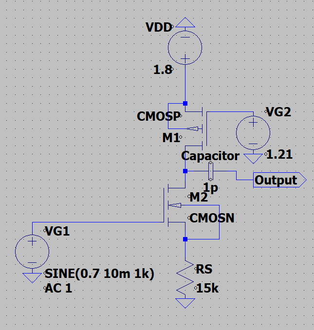
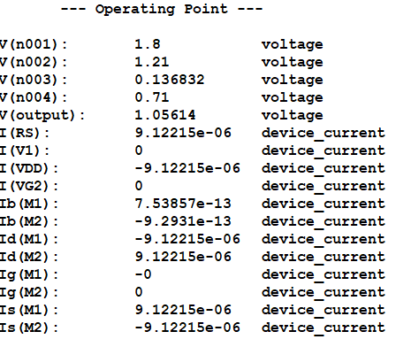
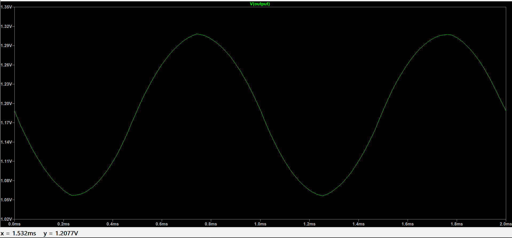
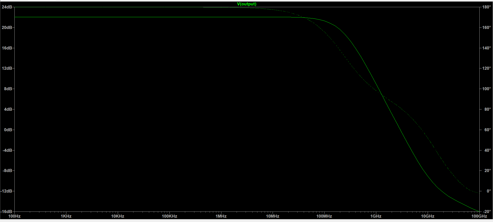
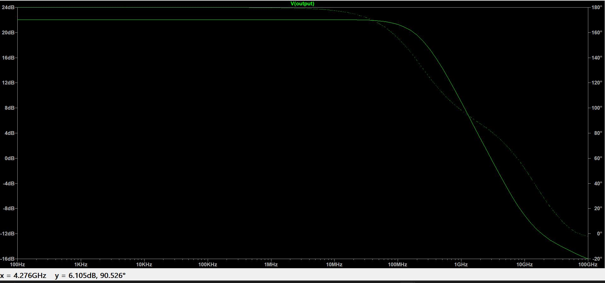

# Experiment 02  
# Performance Analysis of CMOS Amplifier Configurations (180nm Technology)

---

## 1. Objective

To design, simulate, and compare three CMOS amplifier configurations using 180nm technology in LTSpice.

The performance of each configuration is evaluated based on:

- DC operating point
- Voltage gain
- 3dB Bandwidth
- Unity Gain Bandwidth (UGB)
- Output swing
- Power consumption
- Effect of load capacitance

---

## 2. Technology & Simulation Environment

- Technology Node: 180nm CMOS (tsmc018)
- Simulation Tool: LTSpice
- Supply Voltage (VDD): 1.8 V
- Load Capacitance (CL): 1 pF
- Analyses Performed:
  - DC Operating Point (.op)
  - Transient Analysis (.tran)
  - AC Small-Signal Analysis (.ac)

---

# 3. Amplifier Configurations

Three amplifier topologies were implemented as per the assignment requirements.

---

# 🔹 Configuration (a)  
## PMOS Active Load with Source Degeneration

### Circuit Description
- M1: NMOS input transistor
- M2: PMOS active load
- Rs: Source degeneration resistor

### Schematic

---

### DC Operating Point Analysis

Purpose:
- Ensure all MOSFETs operate in saturation
- Extract ID, VGS, VDS
- Compute total power consumption

Power Calculation:

P = VDD × I_total

---

### Transient Analysis

Purpose:
- Verify linear amplification
- Measure voltage gain
- Determine maximum output swing
- Check distortion

---

### AC Small-Signal Analysis

Extracted Parameters:
- Midband Gain
- 3dB Bandwidth
- Unity Gain Bandwidth (UGB)
- Gain roll-off characteristics

Without Load:

With CL = 1pF:

---

# 🔹 Configuration (b)  
## Cascoded Common Source Amplifier

### Circuit Description
- M1: Input NMOS transistor
- M2: PMOS active load
- M3: Cascoding transistor for increased output resistance

### Schematic

---

### DC Operating Point Analysis

- Verified saturation condition for all transistors
- Extracted drain currents and node voltages
- Calculated total power dissipation

---

### Transient Analysis

- Measured voltage gain
- Observed improved gain compared to Configuration (a)
- Verified linear region operation

---

### AC Small-Signal Analysis

Without Load:

With CL = 1pF:

Observation:
Cascoding increases gain due to higher output resistance but may reduce output swing.

---

# 🔹 Configuration (c)  
## Modified / Fully Cascoded Configuration

### Circuit Description
- Enhanced output resistance
- Higher expected gain
- Trade-off with reduced output swing and increased complexity

### Schematic

---

### DC Operating Point Analysis

- Verified proper biasing
- Ensured saturation region operation
- Calculated power consumption

---

### Transient Analysis

- Evaluated amplification performance
- Measured maximum output swing
- Compared linearity with other configurations

---

### AC Small-Signal Analysis

Without Load:

With CL = 1pF:

Observation:
Configuration (c) provides the highest gain among the three but exhibits bandwidth trade-offs.

---

# 4. Theoretical Analysis

Small-signal parameters were calculated:

- gm = 2ID / Vov
- ro ≈ 1 / (λID)
- Voltage Gain ≈ -gm × ro
- Bandwidth ≈ 1 / (2πRoutCL)

Detailed derivations and calculations are provided in:

`calculations.md`

---

# 5. Performance Comparison

| Configuration | Gain (dB) | 3dB BW | UGB | Output Swing | Power |
|--------------|-----------|--------|-----|--------------|-------|
| (a) |  |  |  |  |  |
| (b) |  |  |  |  |  |
| (c) |  |  |  |  |  |

(To be filled with extracted simulation values)

---

# 6. Key Observations

- Source degeneration improves linearity but reduces gain.
- Cascoding significantly increases output resistance and voltage gain.
- Increasing load capacitance reduces bandwidth.
- There exists a trade-off between gain, bandwidth, and output swing.

---

# 7. Conclusion

All three CMOS amplifier configurations were successfully designed and analyzed using 180nm technology in LTSpice.

The experimental results were validated with theoretical small-signal approximations. Performance trade-offs between gain, bandwidth, power consumption, and output swing were systematically compared.

This experiment demonstrates practical understanding of CMOS analog amplifier design and frequency response analysis.